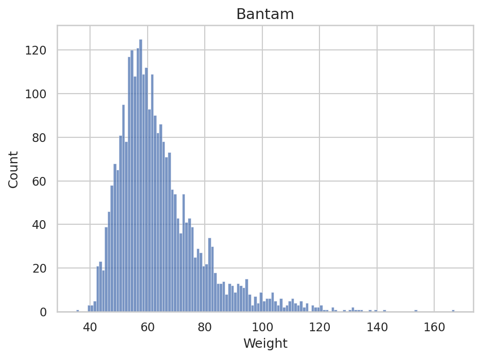
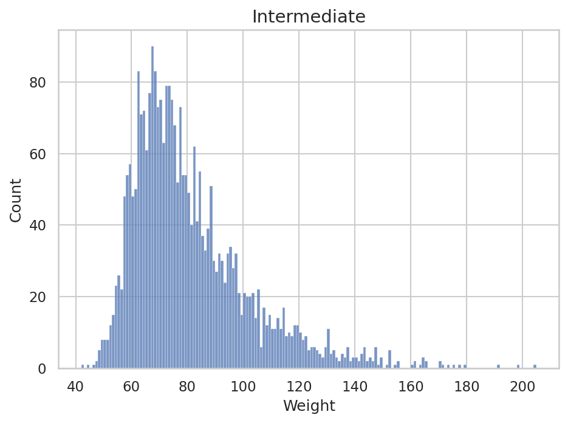
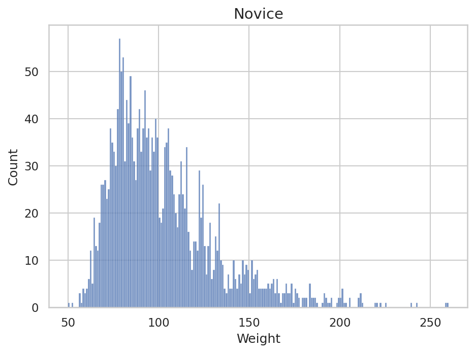
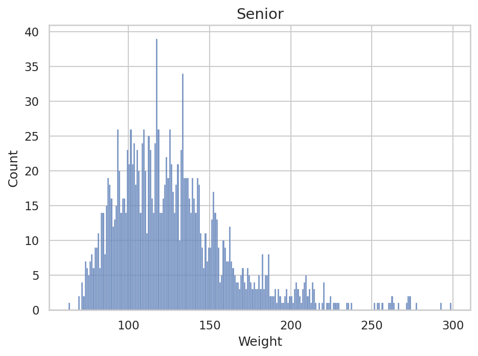
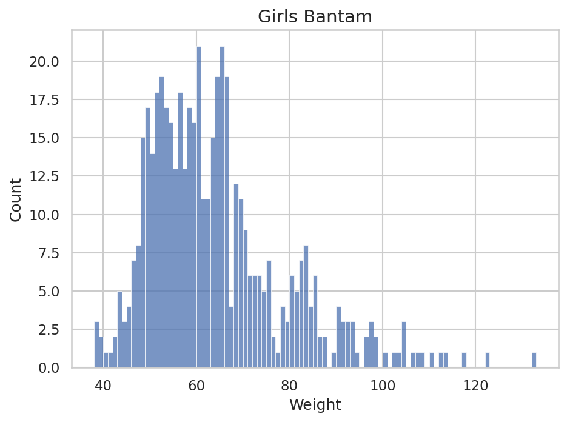
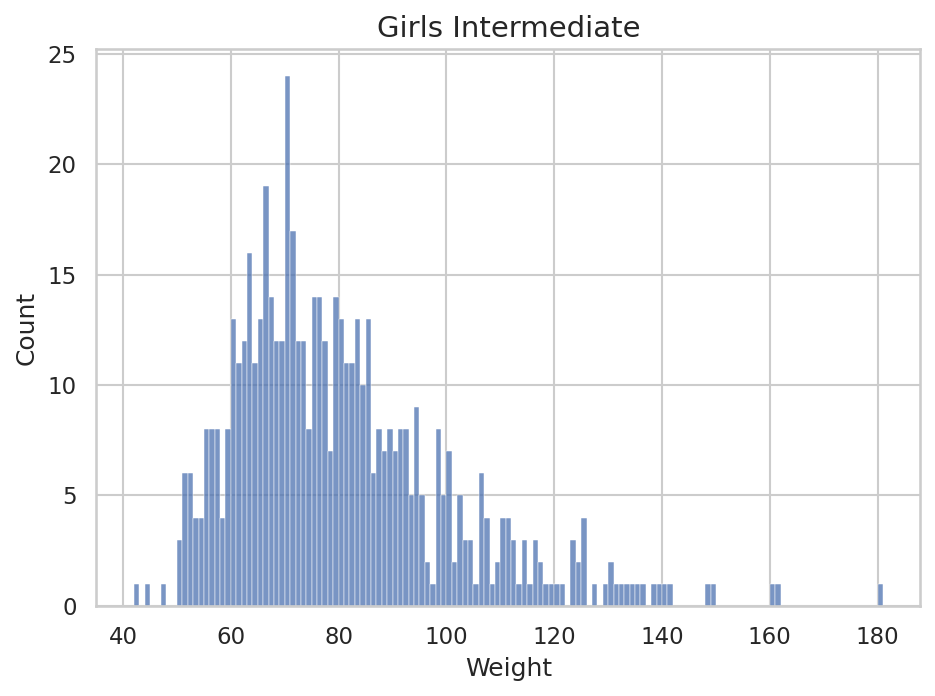
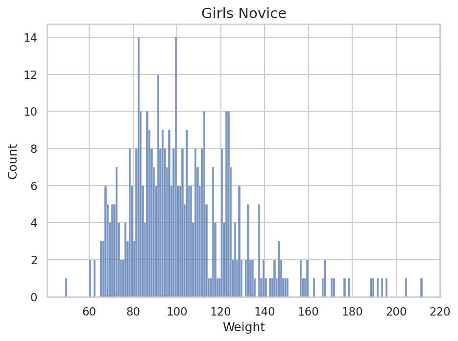
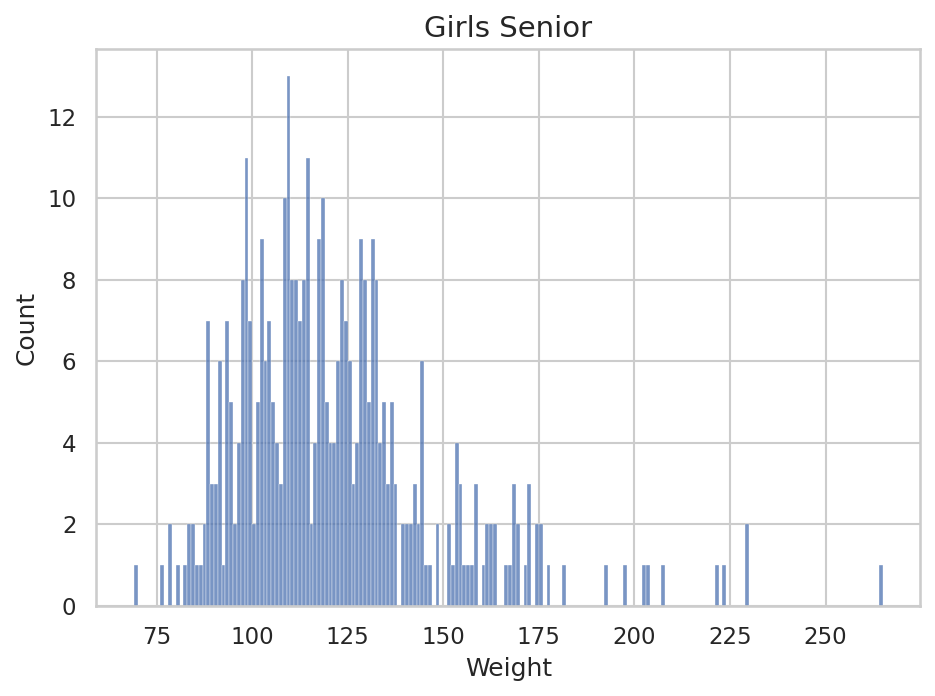

## Notes

- We have 74,258 weigh ins
- An athlete is considered too light if 15.0% below the lowest weight

## Computed weight classes

### Bantam

| Proposed weight  | Athletes | Actual weight    | Athletes |
| ---------------- | -------- | ---------------- | -------- |
| TOO LIGHT (40.8) | 7        | TOO LIGHT (36.5) | 1        |
| 48               | 212      | 43               | 33       |
| 51               | 215      | 46               | 85       |
| 53               | 173      | 49               | 170      |
| 55               | 237      | 52               | 244      |
| 57               | 232      | 55               | 311      |
| 59               | 233      | 58               | 354      |
| 61               | 207      | 62               | 427      |
| 63               | 195      | 66               | 331      |
| 66               | 245      | 70               | 256      |
| 70               | 256      | 76               | 254      |
| 75               | 216      | 84               | 205      |
| 84               | 243      | 95               | 134      |
| 115              | 235      | 120              | 112      |
| TOO HEAVY        | 30       | TOO HEAVY        | 19       |

### Intermediate

| Proposed weight  | Athletes | Actual weight    | Athletes |
| ---------------- | -------- | ---------------- | -------- |
| TOO LIGHT (49.3) | 14       | TOO LIGHT (46.8) | 3        |
| 58               | 167      | 55               | 84       |
| 62               | 212      | 59               | 150      |
| 65               | 224      | 64               | 308      |
| 68               | 227      | 69               | 383      |
| 71               | 235      | 74               | 370      |
| 73               | 142      | 79               | 321      |
| 77               | 270      | 84               | 245      |
| 81               | 229      | 90               | 245      |
| 85               | 198      | 98               | 238      |
| 91               | 217      | 108              | 178      |
| 99               | 233      | 122              | 160      |
| 113              | 219      | 148              | 115      |
| 149              | 214      | 177              | 28       |
| TOO HEAVY        | 31       | TOO HEAVY        | 4        |

### Novice

| Proposed weight  | Athletes | Actual weight    | Athletes |
| ---------------- | -------- | ---------------- | -------- |
| TOO LIGHT (58.6) | 8        | TOO LIGHT (51.0) | 1        |
| 69               | 121      | 60               | 13       |
| 74               | 138      | 64               | 27       |
| 78               | 140      | 69               | 88       |
| 81               | 161      | 74               | 138      |
| 85               | 163      | 80               | 251      |
| 89               | 131      | 86               | 249      |
| 93               | 159      | 93               | 254      |
| 97               | 140      | 100              | 249      |
| 102              | 146      | 108              | 224      |
| 107              | 157      | 116              | 192      |
| 113              | 144      | 125              | 151      |
| 122              | 154      | 134              | 113      |
| 131              | 139      | 154              | 134      |
| 151              | 160      | 178              | 92       |
| 200              | 146      | 215              | 47       |
| TOO HEAVY        | 24       | TOO HEAVY        | 8        |

### Senior

| Proposed weight  | Athletes | Actual weight    | Athletes |
| ---------------- | -------- | ---------------- | -------- |
| TOO LIGHT (70.5) | 3        | TOO LIGHT (62.9) | 0        |
| 83               | 80       | 74               | 16       |
| 90               | 104      | 79               | 32       |
| 95               | 86       | 84               | 49       |
| 101              | 104      | 90               | 90       |
| 105              | 92       | 96               | 100      |
| 109              | 80       | 103              | 137      |
| 114              | 104      | 110              | 149      |
| 118              | 95       | 118              | 175      |
| 123              | 85       | 126              | 152      |
| 128              | 105      | 135              | 177      |
| 133              | 86       | 144              | 155      |
| 138              | 107      | 154              | 106      |
| 144              | 101      | 164              | 82       |
| 153              | 91       | 176              | 55       |
| 164              | 97       | 188              | 53       |
| 185              | 92       | 215              | 64       |
| 251              | 97       | 275              | 32       |
| TOO HEAVY        | 18       | TOO HEAVY        | 3        |

### Girls Bantam

| Proposed weight  | Athletes | Actual weight    | Athletes |
| ---------------- | -------- | ---------------- | -------- |
| TOO LIGHT (41.6) | 6        | TOO LIGHT (38.2) | 0        |
| 49               | 45       | 45               | 17       |
| 52               | 49       | 50               | 54       |
| 56               | 67       | 55               | 82       |
| 59               | 46       | 61               | 97       |
| 63               | 59       | 67               | 96       |
| 66               | 56       | 74               | 54       |
| 71               | 54       | 85               | 52       |
| 82               | 51       | 95               | 25       |
| 110              | 60       | 115              | 19       |
| TOO HEAVY        | 6        | TOO HEAVY        | 3        |

### Girls Intermediate

| Proposed weight  | Athletes | Actual weight    | Athletes |
| ---------------- | -------- | ---------------- | -------- |
| TOO LIGHT (49.3) | 3        | TOO LIGHT (45.0) | 2        |
| 58               | 47       | 53               | 16       |
| 63               | 48       | 57               | 24       |
| 66               | 40       | 62               | 45       |
| 70               | 59       | 67               | 70       |
| 73               | 51       | 72               | 79       |
| 78               | 61       | 77               | 60       |
| 82               | 45       | 82               | 58       |
| 87               | 52       | 88               | 60       |
| 94               | 51       | 95               | 52       |
| 107              | 57       | 115              | 70       |
| 140              | 53       | 135              | 27       |
| TOO HEAVY        | 7        | TOO HEAVY        | 11       |

### Girls Novice

| Proposed weight  | Athletes | Actual weight    | Athletes |
| ---------------- | -------- | ---------------- | -------- |
| TOO LIGHT (60.4) | 1        | TOO LIGHT (53.5) | 1        |
| 71               | 30       | 63               | 4        |
| 79               | 35       | 68               | 12       |
| 83               | 31       | 74               | 30       |
| 88               | 39       | 80               | 25       |
| 92               | 34       | 85               | 41       |
| 96               | 31       | 90               | 38       |
| 100              | 37       | 96               | 50       |
| 106              | 41       | 102              | 50       |
| 111              | 30       | 108              | 37       |
| 120              | 39       | 115              | 45       |
| 124              | 31       | 125              | 53       |
| 137              | 35       | 140              | 36       |
| 189              | 37       | 185              | 28       |
| TOO HEAVY        | 6        | TOO HEAVY        | 7        |

### Girls Senior

| Proposed weight  | Athletes | Actual weight    | Athletes |
| ---------------- | -------- | ---------------- | -------- |
| TOO LIGHT (76.5) | 1        | TOO LIGHT (63.8) | 0        |
| 90               | 23       | 75               | 1        |
| 96               | 24       | 80               | 3        |
| 99               | 23       | 85               | 6        |
| 103              | 23       | 90               | 14       |
| 108              | 25       | 95               | 22       |
| 110              | 23       | 100              | 32       |
| 113              | 23       | 105              | 29       |
| 117              | 26       | 110              | 35       |
| 120              | 23       | 115              | 42       |
| 124              | 22       | 120              | 30       |
| 128              | 20       | 125              | 29       |
| 131              | 22       | 130              | 30       |
| 136              | 29       | 135              | 31       |
| 148              | 27       | 145              | 28       |
| 163              | 23       | 185              | 44       |
| 221              | 24       | 240              | 9        |
| TOO HEAVY        | 5        | TOO HEAVY        | 1        |

